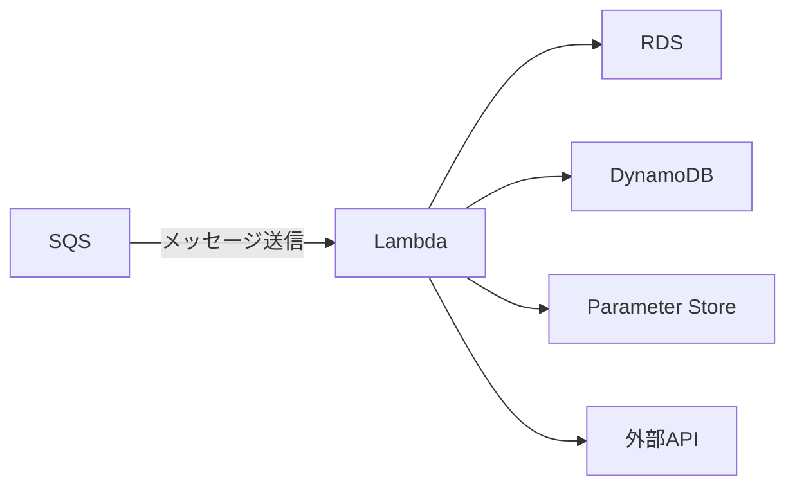
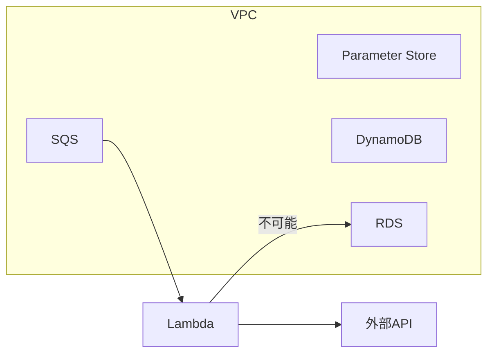

# 【AWS】 LambdaとVPC

会社のプロジェクトでaws lambdaを利用する機能を担当させていただきました。私のLambda初デビューになりますが、結構色々苦難の連続でしたので、今回はその１lambdaとVPCについて語ります。

# 私はどんな状態だったか？



１回目の会社ではAWS側を触る機会がなかったため、AWSにあまり詳しくありませんでした。今勤務している会社ではよくインフラ側の実装にも着手する場合がありました。

連携するAWSリソースは以下でした。

- AWS RDS
- AWS SSM Parameter store
- DynamoDB
- AWS Lambda
- AWS SQS

Lambdaのevent tirggerが作動すると、その他のリソースにアクセスし、処理する仕組みでしたが、RDSからアクセスできない状態

# どうやって気づいたか？

きっかけは完全に偶然でした。前回の実装者がSQLの検証もしなくてSQLの文法エラーが続いて出たため、prepared statementを用意し、SQLを起動時に検証するようにして、間違いがあったらlambdaが落ちるようにする意図でした。しかしこの作業ってRDSに繋がっていないとできないことだったので、アクセスを検証するようになったわけです（実際 pingを投げるべきだが・・・ぐちゃぐちゃの状態のことを完全に書き直したので変なところはあります・・・）。

> try db connection ⇒ SQL検証 ⇒ connection できないことを確認
> 

# 原因

Lambdaのリソースをterraformで生成する際にVPC congurationを指定しないとlambdaは基本的にVPCの外側に作られてしまうことがわかった。

https://registry.terraform.io/providers/hashicorp/aws/latest/docs/resources/lambda_function



# 対策

lambdaをVPCのpublic subnetに配置するように変更が必要だった。

```HCL
resource "aws_lambda_function" "${lambda_name}" {
		# ....
		vpc_config {
		    subnet_ids         = ["${pulbic_subnet_id}", ...]
		    security_group_ids = ["${security_group_for_lambda}", ...]
		}
}
```

しかし、VPCに属するようにしたら、外部APIに通信できない問題が発生してしまう・・・VPCは基本的にprivate networkのせいである。

なので、以下が必要になる。

- lambdaに適用したsecurity groupに適切なoutbound ruleを追加
- parameter storeやdynamodbなどVPC内のリソースに適用されたsecurity groupにもinbound ruleの追加