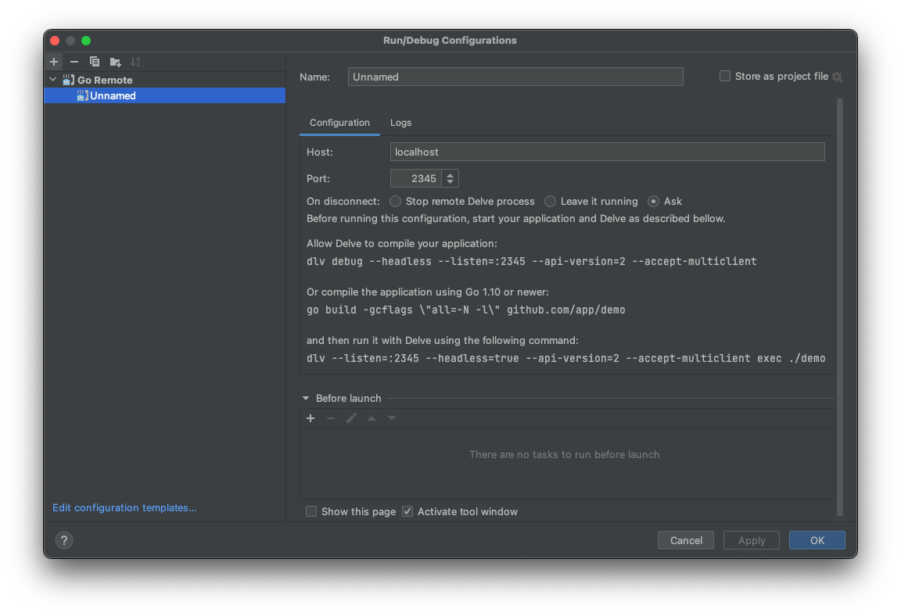

# 【golang】docker containerのソースコードをdebugしてみる
普段debugするには`delve`というツールを使います。ローカルで動かせる時はdebuggerに特に問題はないですが、「remote serverのソースコードをdebugするにはどうすればいい？」となりました。そもそも、ローカルでの開発だとはいえ、本気で開発するのならローカルでもコンテナの中で動かしてみるのが当然になります。

# 業務には？

私が勤務してる会社のプロジェクトを少し見てみましたが、ローカルに動かすdocker imageはhot-reloadはairというツールでやっていましたが、debugはできるようになってなかったです。

# コンテナのコードをdebugしてみよう。

一旦、会社ではないため今はリリーズで精一杯なわけで、後で提案したりすることにして、やり方だけ把握しておこうという考えで調べました。

## Dockerfile

```docker
FROM golang:1.22.0 AS builder
WORKDIR /build

ENV CGO_ENABLE=0

COPY go.mod ./
RUN go mod download
COPY . ./
RUN go build -gcflags "all=-N -l" -o bootstrap #  -gcflags "all=-N -l" ... disable compiler optimization

# Install delve
RUN go install github.com/go-delve/delve/cmd/dlv@latest

EXPOSE 8080
EXPOSE 2345
ENTRYPOINT ["/go/bin/dlv", "--listen=:2345", "--headless=true", "--api-version=2", "--accept-multiclient", "exec", "/build/bootstrap", "--continue"]
```

コンテナにはgoのbuildしたものがあり、debugのため`delve`もインストールします。こちらでは2個のportを外に出しているのですが、一個はアプリサーバのport(`:8080`)でdelveを用いるdebug通信のためもう一個のport(`:2345`)を外に出しています。

# docker-compose.yml

```yaml
version: "3"
services:
  server:
    build:
      context: .
      dockerfile: ./Dockerfile
    ports:
      - "8081:8080"
      - "2345:2345"
```

コンテナ一個だけ使いますので、docker composeまでは必要ないとは思いつつ、でも基本的には複数のコンテナを動かすので、作っておきます。

## ソースコード

```go
package main

import (
	"context"
	"fmt"
	"github.com/labstack/echo/v4"
	"log/slog"
	"net/http"
	"time"
)

type errorResponse struct {
	Msg string `json:"err_msg"`
}

type okResponse struct {
	UnixTime int `json:"unix_time"`
}

func main() {
	ctx := context.Background()
	e := echo.New()
	e.GET("/unix-time", unixTimeHandler)

	err := e.Start(":8080")
	slog.InfoContext(ctx, "start simple server", slog.String("err", err.Error()))
}

func unixTimeHandler(c echo.Context) error {
	d := c.QueryParam("date")
	t := c.QueryParam("time")

	dateTime, err := time.ParseInLocation(time.DateTime, fmt.Sprintf("%s %s", d, t), time.Local)
	if err != nil {
		return c.JSON(http.StatusInternalServerError, errorResponse{
			Msg: err.Error(),
		})
	}

	return c.JSON(http.StatusOK, okResponse{
		UnixTime: int(dateTime.Unix()),
	})
}
```

サーバは簡単にしました。日付をもらったらそれをUnixtimestampにして返す超簡単なAPIになります。

# Golandでのテスト

GopherはVScode・Golandを主に使うようです。うちの会社のメンバーは大体VScodeです。会社はIDEを決めてない(実は社内de factoとしてVScode・・・)ので、自分はGolandを使っています。

なので、一旦Golandでのやり方をまとめて、時間があるうちにVScodeのdebug方法も整理しておこうと思います。

## 設定



1. Run > Edit Configurations
2. ＋ > Go Remote
3. Host: `localhost` (ホストは対象になるコンテナにすれば良い、今回はローカルコンテナなので・・)
4. Port: `2345`

## 設定後

1. `docker-compose up --build -d`でコンテナを立ち上げる
2. Golandでコードにbreakpointsを指定する
3. debugアイコンを押してコンテナとdebug通信を始める
4. 以下のコマンドを叩いて確認する

# Repository
やってたことをrepositoryを作って残しました。
- https://github.com/Aivyss/go-docker-debug
- git@github.com:Aivyss/go-docker-debug.git